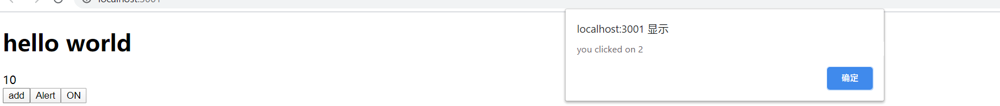

<!-- START doctoc generated TOC please keep comment here to allow auto update -->
<!-- DON'T EDIT THIS SECTION, INSTEAD RE-RUN doctoc TO UPDATE -->
**Table of Contents**  *generated with [DocToc](https://github.com/thlorenz/doctoc)*

- [1. 什么是Hook？](#1-%E4%BB%80%E4%B9%88%E6%98%AFhook)
- [2. 参考资料](#2-%E5%8F%82%E8%80%83%E8%B5%84%E6%96%99)
- [3. 类组件的缺点](#3-%E7%B1%BB%E7%BB%84%E4%BB%B6%E7%9A%84%E7%BC%BA%E7%82%B9)
- [4. Hooks优势](#4-hooks%E4%BC%98%E5%8A%BF)
- [5. Hook规则](#5-hook%E8%A7%84%E5%88%99)
- [6. useState](#6-usestate)
- [7. useEffect](#7-useeffect)
- [8. 自定义hooks](#8-%E8%87%AA%E5%AE%9A%E4%B9%89hooks)
- [9. useRef](#9-useref)
- [10. useContext](#10-usecontext)

<!-- END doctoc generated TOC please keep comment here to allow auto update -->

### 1. 什么是Hook？
引用自官网：
> Hooks let you use state and other React features without writing a class.

### 2. 参考资料
1. [react hooks 使用](https://segmentfault.com/a/1190000019513907)
2. [React Hooks](https://blog.csdn.net/sinat_17775997/article/details/84794837)
3. [React Hooks 深入不浅出](https://segmentfault.com/a/1190000017182184)
4. 介绍了很多有用的第三方hooks：[useHooks](https://usehooks.com/)
5. 中文文档：[Hook API 索引](https://react.docschina.org/docs/hooks-reference.html)
6. 英文文档：[Hooks API Reference](https://reactjs.org/docs/hooks-reference.html)
### 3. 类组件的缺点
- 状态逻辑复用难
  - 缺少复用机制
  - 渲染属性和高阶组件导致层级冗余
- 趋向复杂难以维护
  - 生命周期函数混杂不相干
  - 相干逻辑分散在不同的生命周期
- this指向困扰
  - 内联函数过度创建新句柄
  - 类成员函数不能保证this
  
### 4. Hooks优势
优化类组件的三大问题
  - 函数组件无this问题
  - 自定义Hooks方便复用状态逻辑
  - 副作用的关注点分离
  
### 5. Hook规则

1. 只在最顶层调用hook函数，不能再for、if、 try等内部使用。
2. 只在React函数中调用hook函数，不能再普通的JavaScript函数中调用hook。

### 6. useState

1. state hook 提供了一种可以在 function component 中添加状态的方式。通过 state hook，可以抽取状态逻辑，使组件变得可测试，可重用。开发者可以在不改变组件层次结构的情况下，去重用状态逻辑。更好的实现关注点分离。  

2. state hook的主要作用就是获取需要的 state 和 更新state的方法。

3. useState用来替换类组件的state。

4. 要点
   1. 在组件的最顶层按照顺序调用useState。
   2. 不能动态调用，如在if语句，for循环中等都不可使用useState。

5. useState可以接收一个函数，延迟初始化，也就是负责逻辑的转换，从而得到一个新的初始值。

6. 一个useState只负责一个状态。

7. 用法
   - 语法：  
     `const [state, setState] = useState(initialState);`
   - 说明：`initialState`是当前`state`的初始值，也可以是一个函数，函数的返回值将作为`state`的值，参数只会在组件的初始渲染中起作用。
   - `useState()`返回一个数组。数组的第一个元素是当前`state`的值，第二个是更新`state`的方法。这里的更新`state`的方法，与类组件中`setState()`不同之处在于，它不会合并所有的`state`。
   - 如果想定义多个`state`，那么多次调用`useState`即可。
   - setState()接收的参数，我们可以将其写成一个函数，通过函数来表达state的变化，函数的返回值作为setState()的最终参数，体现了函数式编程的思想。例如：
   ```tsx
      const [count, setCount] = useState(0);
      <button onClick={() => setCount(x => x + 1)}>add</button>
   ```
8. 示例代码：
   ```tsx
      import React, {useState} from 'react';
      
      const App: React.FC = () => {
          // useState()接收一个初始值，返回值是一个数组，使用解构的方法进行接收
          // 数组的第一个值是state，第二个值是一个函数，是用来更新state，函数接收的数据类型、state的类型
          // 必须与初始值一样
          const [count, setCount] = useState(0);
          // 不必像类组件，我们可以将不同的数据状态写在不同state中
          const [on, setOn] = useState(true);
          return (
              <div className="App">
                  <h1>hello world</h1>
                  <div>{count}</div>
                  <button onClick={() => setCount(x => x + 1)}>add</button>
                  <button onClick={() => setOn(on => !on)}>
                      {on ? 'ON' : 'OFF'}
                  </button>
              </div>
          );
      }
      
      export default App;
   ```
    
### 7. useEffect

1. 数据获取，设置订阅，手动的更改 DOM，都可以称为副作用，可以将副作用分为两种，一种是需要清理的，另外一种是不需要清理的。比如网络请求，DOM 更改，日志这些副作用都不要清理。而比如定时器，事件监听，则需要清理。

2. 副作用调用时机：
   1. Mount之后
   2. Update之后
   3. Unmount之前
   
3. useEffect调用时机  
useEffect在render之后调用，在不同的render时刻，就相当于使用componentDidMount、componentDidUpdate这些回调函数。  
useEffect还会返回一个回调函数，这个回调函数的执行时机很重要。同useEffect的调用时机是挂钩的。这个回调函数在组件渲染前调用。严格来说，在前一次的渲染视图被清除之前。相当于componentWillUnmount。

4. 用法
   - 语法  
     `useEffect(effect, deps)`
   - 说明：effect是一个函数，每次渲染之后执行，可以在函数编写更新DOM、添加订阅等。
   - effect函数的返回值可以空值（void）或者是一个函数（clean-up function），如果是函数，则这个返回值函数会在组件卸载前执行(每次渲染都会执行)，需要清除上次订阅的内容可以再这里面写。
   - deps是一个可选参数，值是一个数组，数组的元素数量可以有多个。只有数组中任何一个元素的值发生变化才会调用useEffect()。如果只想在第一次挂载和卸载组件的时候调用，只需要传一个空数组。

5. 示例代码：
   - useEffect()的基本使用
     ```tsx
        import React, { useEffect, useState } from 'react';
              
        const MouseTracker: React.FC = () => {
            const [position, setPosition] = useState({ x: 0, y: 0 });
              
            useEffect(() => {
                console.log('add effect', position.x);
                const mouseUpdate = (e: MouseEvent) => {
                    console.log('inner');
                    setPosition(() => ({ x: e.clientX, y: e.clientY }));
                };
              
                document.addEventListener('click', mouseUpdate);
              
            // useEffect()的第一个参数的返回值可以是一个函数，这个函数会在组件卸载前执行，被称为clean-up function
            // 因此，在这个返回值函数里面，可以进行一些清除工作，如清除事件、清除定时器等
            return () => {
                console.log('remove effect', position.x);
                document.removeEventListener('click', mouseUpdate);
            };
        }, []);
        console.log('before render', position.x);
        return (
            <div>
                <p>
                   X: {position.x}, Y: {position.y}
                </p>
            </div>
        );     
     };
              
     export default MouseTracker;
     ```
   - 第二个参数的作用
     ```tsx
        // App.tsx
        const [show, setShow] = useState(true);
        
        // 如果没有第二个参数，那么组件每一次更新，都会调用
        // 此时我们加入第二个参数，值为数组，只有数组内的元素的值发生变化，才会调用这个useEffect()
        // 也就是说，只有count更新了，useEffect()才会被调用，进而更新了DOM
        useEffect(() => {
            console.log(`document title is running`);
                document.title = `点击了${count}次`;
        }, [count]);
     ```
     通过count来控制useEffect()的调用时机。
     
### 8. 自定义hooks

1. 自定义的hooks以`use`开头。

2. 两个组件中使用相同的自定义hooks，不会共享state和effect，所有的state和effect都是相互隔离的，不会相互影响。

3. 自定义hooks主要是用来复用组件的状态。也就是说，定义一个公共的函数组件，其他的组件可以引用这个公共组件。使用方式比较简洁。在hooks出现之前，我们想复用一个组件，只能通过HOC或者`render props`的方式。  
    HOC（Higher Order Component）高阶组件，这是React提出的一个概念，并不是一个真正的API。高阶组件是一个函数，接收一个组件作为参数，返回一个新的组件。HOC难于理解，且会引入额外的嵌套结构。

4. 自定义一个hooks：
   ```tsx
      import React, { useState, useEffect } from 'react';
      
      const useMousePosition = () => {
          const [position, setPosition] = useState({ x: 0, y: 0 });
          useEffect(() => {
              console.log('add effect', position.x);
              const mouseUpdate = (e: MouseEvent) => {
                  setPosition(() => ({ x: e.clientX, y: e.clientY }));
              };
      
              document.addEventListener('mousemove', mouseUpdate);
      
              // useEffect()的第一个参数的返回值可以是一个函数，这个函数会在组件卸载前执行，被称为clean-up function
              // 因此，在这个返回值函数里面，可以进行一些清除工作，如清除事件、清除定时器等
              return () => {
                  console.log('remove effect', position.x);
                  document.removeEventListener('mousemove', mouseUpdate);
              };
          }, []);
      
          return position;
      };
      
      export default useMousePosition;
   ```

5. 使用自定义hooks
   ```tsx
      // App.tsx
      import React, { useState, useEffect } from 'react';
      // 引入自定义hooks
      import useMousePosition from './hooks/useMousePosition';
   
      const App: React.FC = () => {
          // useState()接收一个初始值，返回值是一个数组，使用解构的方法进行接收
          // 数组的第一个值是state，第二个值是一个函数，是用来更新state，函数接收的数据类型、state的类型
          // 必须与初始值一样
          const [count, setCount] = useState(0);
          // 不必像类组件，我们可以将不同的数据状态写在不同state中
          const [on, setOn] = useState(true);
      
          const [show, setShow] = useState(true);
      
          // 使用自定义hooks
          // 自定义hooks以use开头
          const position = useMousePosition();
      
       
          return (
              <div className="App">
                  <div>
                      <h1>hello world</h1>
                      <div>{count}</div>
                      <button onClick={() => setCount(x => x + 1)}>add</button>
                      <button onClick={() => setOn(on => !on)}>
                          {on ? 'ON' : 'OFF'}
                      </button>
      
                      <p>
                          X: {position.x}, Y: {position.y}
                      </p>
                  </div>
              </div>
          );
      }
      export default App;
   ```
   
6. 使用自定义hooks，我们就可以将一些公共逻辑放在自定义的hooks中，引用自定义的hooks就像引用函数一样，从里面拿出数据，然后进行渲染。还可以根据不同的组件向自定义hooks传入不同的参数，进而得到不同的数据。极大地提高了组件的灵活性和复用性。

### 9. useRef

1. 函数组件在渲染过程中，每一次的state和props都是相互独立的。示例代码：
   ```tsx  
   const App = () => {
       const [count, setCount] = useState(0);
       function handleAlertClick() {
            setTimeout(function () {
                alert('you clicked on ' + count);
            }, 3000);
       }
   
       return (
            <div>    
                <div>{count}</div>
                <button onClick={() => setCount(x => x + 1)}>add</button>
                <button onClick={handleAlertClick}>Alert</button>            
            </div>
       )
   }
   ```
   第一个button用于计数，第二个button，绑定了一个点击事件，点击后，延迟3s，弹窗提示点击按钮时的count值。  
   我们首先点击第一个按钮，点击两次，然后点击第二个按钮，然后再点击第一个按钮，点击多次，比如说到10，3s后，弹窗出现，显示的count时点击第二个按钮时的2次。由此，可以看出，handleAlertClick()处理函数保留了点击时刻的count值，并形成了一个闭包。图示：
   
    
    
   从这个例子中可以看出，组件在每一次渲染过程中的state和props都是独立的。

2. useRef()主要是可以在渲染过程中保持状态。也就是说，始终保持着同一个引用。

3. 用法
   - 语法  
     `const refContainer = useRef(initialValue);`
   - `initialValue` 表示初始值，类型可以时字符串，数字等。useRef()的返回值是一个可变（mutable）的 `ref` 对象，其中的`current` 属性被初始化为传入的参数（initialValue）。返回的 `ref` 对象在组件的整个生命周期内保持不变。
   - 我们可以使用useRef()来获取一个DOM节点。示例代码如下：
     ```tsx
        useEffect(() => {
            console.log('inputRef', inputRef);
            if (inputRef && inputRef.current) {
                // 真正保存input元素的还是current属性
                inputRef.current.focus();
            }
        });
        // useRef()可以用来获取真实的DOM节点，从而能够对节点进行操作
        const inputRef = useRef<HTMLInputElement>(null);
        
        return (
         <React.Fragment>
            {/*
               获取input元素的ref属性，并将其赋给inputRef，这样inputRef时对input元素的引用，进而可以对其进行DOM操作
               真正保存input元素的还是current属性
            */}
            <input type="text" ref={inputRef} />
         </React.Fragment> 
        )
     ```
     `inputRef`中的`current`属性指向了`input`元素，并且在整个组件的生命周期内，无论该节点如何改变，`React`都会将`inputRef`对象的`current`属性设置为相应的input元素。
     
4. useRef()比`ref`属性更有用。它可以很方便地保存任何可变值，其类似于在`class`中使用实例字段的方式。 
 
   这是因为它创建的是一个普通`Javascript`对象。而 useRef()和自建一个`{current: ...}`对象的唯一区别是，useRef()会在每次渲染时返回同一个`ref`对象。
   
5. **注意**：当`ref`对象内容发生变化时，useRef()并不会通知你。current属性值的更新不会引发组件重新渲染。

6. 以上内容来自React中文文档：[useRef](https://react.docschina.org/docs/hooks-reference.html#useref)

### 10. useContext

1. 这个hooks用来简化Context的使用。

2. React组件之间传递数据，传统方式只能是单向单层传递，不能跨组件传递。为了解决这个问题，React提供了Context，使得跨组件传递数据成为可能。

3. Context有两个核心的组件：Provider和Consumer。这两个组件通过React.createContext()生成。

4. createContext()接收一个初始值，返回值是一个对象，这个对象包含了两个属性：Provider和Consumer，也就是上面所说的核心组件。可以使用解构的方式进行接收。示例代码如下：
   ```tsx
      const {Provider, Consumer} = React.createContext(initialValue);
   ```
5. Provider组件时数据的提供者，通过`value`属性接收存储的公共状态，来传递给子组件或后代组件。示例：
   ```tsx
      <Provider value={val}>
           <childComponent />
      </Provider> 
   ```
   Provider组件一般用在需要向子组件或者后代组件传递数据的地方。可以放在根组件中。要传递的数值放在`value`属性中。

6. Consumer组件是数据的消费者，通过订阅Provider传入的context的值，来实时更新当前组件的状态。示例：
   ```tsx
      <Consumer>
           {
               value => (
                   <h1>Consumer: {value}</h1>
               )
           }
      </Consumer>
   ```
   Consumer组件中不能直接渲染一个组件，而是要声明一个函数，函数接收的参数就是context值，函数的返回值就是我们需要渲染的组件。
   
7. 下面的代码完整的展示了Context的用法：
   ```tsx
      // hello.tsx
      import React from 'react';
   
      import Middle from './middle';
      export const { Provider, Consumer } = React.createContext(0);
      
      const Hello: React.FC = () => {
          return (
              <React.Fragment>
                  <Provider value={60}>
                      <Middle />
                  </Provider>
              </React.Fragment>
          );
      };  
      export default Hello;
   
      // middle.tsx
      import React from 'react'; 
      import Leaf from './leaf';
      
      const Middle: React.FC = () => {
          return (
              <React.Fragment>
                  <Leaf />
              </React.Fragment>
          );
      };  
      export default Middle;
   
      // leaf.tsx
      import React from 'react'; 
      import { Consumer } from './hello';
      
      const Leaf: React.FC = () => {
          return (
              <React.Fragment>
                  <Consumer>{value => <h1>battery: {value}</h1>}</Consumer>
              </React.Fragment>
          );
      };   
      export default Leaf;
   ```
   渲染结果：  
   
     
   Context确实实现了跨级通信。Provider组件的value属性，接收公共的数据。在需要接收数据的后代组件处，引入Consumer组件。在Consumer组件内，使用函数生成一个真正被渲染的组件。
8. Context参考资料：
   - [React系列——React Context](https://segmentfault.com/a/1190000017758300)
   - [React的Context的使用方法简介](https://www.cnblogs.com/littleSpill/p/11221538.html)
   
8. 从上面的Context的用法可以看出，后代组件想使用Consumer组件比较麻烦。使用useContext()可以简化这一步。

9. 用法
   - 语法  
     `const value = useContext(MyContext);`
   - 说明：`MyContext`是Context对象，也就是直接由`React.createContext()`生成的那个对象。value是当前Context的值。**注意**：当前的 Context 值由上层组件中距离当前组件最近的`<MyContext.Provider>` 的`value`决定。
   - 当组件上层最近的`<MyContext.Provider>`更新时，该Hook会触发重渲染，并使用最新传递给`<MyContext.Provider>`的value的值。

10. **注意**：useContext()接收的一定是Context对象，也就是直接由`React.createContext()`生成的那个对象。不是Provider也不是Consumer。

11. `useContext(MyContext)`只是让我们能获取Context的值以及订阅 Context的变化。我们仍然需要在上层组件树中使用`<MyContext.Provider>`来为下层组件提供Context。

12. 下面的代码展示了useContext()的用法：
    ```tsx
       // App.tsx
       import React from 'react';
       import Hello from './components/hello';
    
       interface IThemeProps {
           [key: string]: { color: string; background: string };
       }
       
       const themes: IThemeProps = {
           light: {
               color: '#000',
               background: '#eee',
           },
           dark: {
               color: '#fff',
               background: '#222',
           },
       };
       
       // 创建一个context，并传入初始值
       export const themeContext = React.createContext(themes.light);
       const App: React.FC = () => {
           return (
               <themeContext.Provider value={themes.dark}>
                   <div className="App">
                       <Hello />
                   </div>
               </themeContext.Provider>
               );
       }
    
       // hello.tsx
       import React, { useContext } from 'react';
       // 从App组件中引入Context对象
       import { themeContext } from '../App';    
    
       const Hello: React.FC = () => {
           // useContext()接收一个Context对象作为参数
           // useContext()返回的是Context的值，也就是Provider组件的value的值
           const theme = useContext(themeContext);
           const style = {
               color: theme.color,
               background: theme.background,
           };
           return (
               <React.Fragment>
                   <h2 style={style}>Hello World</h2>
               </React.Fragment>
           );
       };
       export default Hello;
    ```
    需要使用哪个组件中的Context对象，我们就从哪个组件中导入这个Context对象，然后作为参数传入useContext()中。