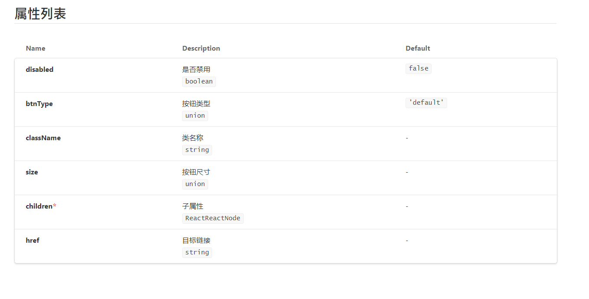
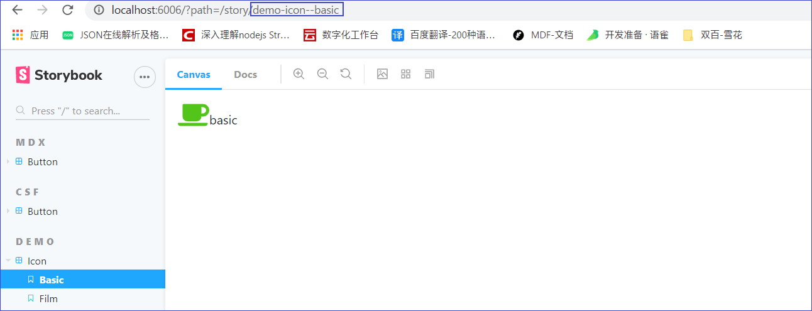

<!-- START doctoc generated TOC please keep comment here to allow auto update -->
<!-- DON'T EDIT THIS SECTION, INSTEAD RE-RUN doctoc TO UPDATE -->
**Table of Contents**  *generated with [DocToc](https://github.com/thlorenz/doctoc)*

- [Storybook使用总结](#storybook%E4%BD%BF%E7%94%A8%E6%80%BB%E7%BB%93)
    - [1.概述](#1%E6%A6%82%E8%BF%B0)
    - [2. 安装](#2-%E5%AE%89%E8%A3%85)
    - [3.使用 -- 书写 Story](#3%E4%BD%BF%E7%94%A8----%E4%B9%A6%E5%86%99-story)
      - [1.基本介绍](#1%E5%9F%BA%E6%9C%AC%E4%BB%8B%E7%BB%8D)
      - [2.两种书写方式](#2%E4%B8%A4%E7%A7%8D%E4%B9%A6%E5%86%99%E6%96%B9%E5%BC%8F)
      - [3.使用 CSF 的方式](#3%E4%BD%BF%E7%94%A8-csf-%E7%9A%84%E6%96%B9%E5%BC%8F)
    - [4.使用--书写 Doc](#4%E4%BD%BF%E7%94%A8--%E4%B9%A6%E5%86%99-doc)
      - [1.参考资料](#1%E5%8F%82%E8%80%83%E8%B5%84%E6%96%99)
      - [2.基本介绍](#2%E5%9F%BA%E6%9C%AC%E4%BB%8B%E7%BB%8D)
      - [3.`addon-docs`](#3addon-docs)
      - [4.生成自定义 props 表格](#4%E7%94%9F%E6%88%90%E8%87%AA%E5%AE%9A%E4%B9%89-props-%E8%A1%A8%E6%A0%BC)
      - [5.以 MDX 的方式书写文档](#5%E4%BB%A5-mdx-%E7%9A%84%E6%96%B9%E5%BC%8F%E4%B9%A6%E5%86%99%E6%96%87%E6%A1%A3)
      - [6.CSF 和 MDX 的结合](#6csf-%E5%92%8C-mdx-%E7%9A%84%E7%BB%93%E5%90%88)

<!-- END doctoc generated TOC please keep comment here to allow auto update -->

# Storybook使用总结

### 1.概述
1. Storybook 是一个 UI 框架，可以用来管理组件库。目前最新的版本是 6.0。

2. 官方地址：[Storybook](https://storybook.js.org/) 

3. github 地址：[storybook](https://github.com/storybookjs/storybook)

4. 最新版的 Storybook 引入许多新内容，在记录一下基本的使用方法。

### 2.安装

1. Storybook 支持多种框架，如 React、Vue 等。我们这里使用的是 React。生成项目使用的是 create-react-app，使用的是 Typescript 进行开发。在项目已经创建的情况下，在命令行输入：  
   `npx sb init`  
   即可完成 Storybook 的初始化工作。

2. 几个需要注意的点：
   1. `npx sb init` 不能在空的项目下执行。通常是我们通过 create-react-app 创建一个项目后，在执行这个命令。
   2. 不需要我们手动配置，在执行 `npx sb init` 命令后，Storybook 会根据项目的依赖自动完成配置工作。
   3. Storybook 的配置文件在项目的根目录下的 `.storybook`文件夹中，主要有两个文件：
      - `main.js`
      - `preview.js`
      
### 3.使用 -- 书写 Story

#### 1.基本介绍
- 所谓的 Story，我的理解就是根据不同属性和状态渲染的组件，然后将这个组件展示出来。下面是官网对于 Story 的介绍：
     > A story captures the rendered state of a UI component. Developers write multiple stories per component that describe all the “interesting” states a component can support.
          
#### 2.两种书写方式
- Story 目前有两种书写方式，第一种是 CSF（Component Story Format ），即使用 ES6 模块化的方式，完成 Story 的书写。第二种是使用 storiesOf() API的方式书写。第一种是目前版本推荐的方式，第二种是过时（legacy）的方式。
#### 3.使用 CSF 的方式
- 详细介绍：[how to write stories](https://storybook.js.org/docs/react/writing-stories/introduction)
- stories 文件是以 `.stories.jsx` 或者是 `.stories.tsx` 为后缀。
- 将 stories 文件建在与组件同级的文件夹中。在 `.storybook` 中的 `main.js` 中配置：
     ```javascript
          module.exports = {
              "stories": [
                  // "../src/**/*.stories.mdx",
                  "../src/**/*.stories.@(js|jsx|ts|tsx|mdx)"
              ],
          }
     ```  
     `stories` 这个配置项表示 Storybook 会加载哪些路径下的 stories 文件。
- 基本代码：
     ```typescript
        import { Story, Meta } from '@storybook/react/types-6-0';
        import {action} from '@storybook/addon-actions';
        import Button, { ButtonProps } from './button';
        /**
         * 使用 CSF (Component Story Format)  的方式书写 story
         */
        export default {
            title: 'Button',
            component: Button,
        } as Meta;
        
        const Template: Story<ButtonProps> = (args) => (<Button {...args} />);
        const TemplateWithDifferentSize: Story<ButtonProps> = (args) => (<Button {...args} />);
        
        export const Primary = Template.bind({});
        Primary.args = {
            btnType: 'primary',
            children: 'Primary'
        };
        
        export const Danger = Template.bind({});
        Danger.args = {
            btnType: 'danger',
            children: 'Danger'
        };
        
        export const LargeButton = TemplateWithDifferentSize.bind({});
        LargeButton.args = {
            children: 'Large',
            size: 'large'
        }
        
        export const SmallButton = TemplateWithDifferentSize.bind({});
        SmallButton.args = {
            children: 'Small',
            size: 'small'
        }
     ```
     
- **使用 CSF 的方式，每个定义的 story 都需要使用 export 的方式导出**。
- 默认导出（default export）
     ```typescript
          export default {
              title: 'Button',
              component: Button,
                  } as Meta;
     ```
     默认导出元数据，控制着 Storybook 展示的组件的 stories，并且给插件（addons）提供基本的信息。
- 定义 story  
  一个 story 就是一个函数，定义如何渲染组件。我们可以给一个组件定义多个 story。
     ```tsx
         export const primary: React.FC<{}> = () => <Button btnType="primary">primary</Button>
         export const danger: React.FC<{}> = () => <Button btnType="danger">danger</Button>
     ```
       这种方式可以给一个组件注册多个 story。
     - 使用 args 定义 story  
       这个 args 实际上就是组件的 props。  
     ```tsx
          const Template: Story<ButtonProps> = (args) => (<Button {...args} />);
          export const Primary = Template.bind({});
          Primary.args = {
                 btnType: 'primary',
                 children: 'Primary',
                 onClick: action('clicked')
          };
                  
          export const Danger = Template.bind({});
          Danger.args = {
                   btnType: 'danger',
                   children: 'Danger'
          };
     ```
    首先创建一个组件模板（Template），这个模板的类型是 Story，泛型指定为 ButtonProps，模板是一个函数，函数接收一个 args 参数，最后返回的是一个组件。  
       `const Template: Story<ButtonProps> = (args) => (<Button {...args} />);`  
        `Template.bind({})` 实际上是创建组件模板的副本。然后给副本的 args 赋值。赋值的内容就是组件的自定义的 props 中的属性。
     ```tsx
         export const Primary = Template.bind({});
         Primary.args = {
             btnType: 'primary',
             children: 'Primary'
         };
     ```
     使用 args 的好处是可以复用某个 story 的 props 的属性，同时还可以和插件（addons）、控制（control）结合，在展示组件的页面可以对组件进行更多的操作。
        
- 使用 parameters   
  参考资料：[Parameters](https://storybook.js.org/docs/react/writing-stories/parameters)  
  Parameters 是 Storybook 中的一个方法，用来给 story 定义静态的元数据（static metadata）。  
   比如说，我只想给 Button 组件的 story 设置不同的背景，那么通过 Parameters 就可以设置。
     ```tsx
        export default {
            title: 'CSF-1/Button',
            component: Button,
            parameters: {
                backgrounds: {
                    values: [
                        { name: 'red', value: '#f00' },
                        { name: 'green', value: '#0f0' },
                        {name: 'black', value: '#000'}
                    ],
                },
            },
        } as Meta;
     ```
   这样设置以后，就可以在 Button 组件的所有 story 中切换背景。  
   可以在三个地方设置 paramaters：组件（Component）、story 和全局（global），分别对应三个级别，上面示例代码设置的是组件级别，在 `export default` 导出的组件中设置，这样可以使得同一组件的所有story都能应用到这个 parameters。 
   还可以在 story 中设置 parameters。这样仅仅是在这个 story 中起作用。  
     ```tsx
          const Template: Story<ButtonProps> = (args) => (<Button {...args} />);
          
          export const Primary = Template.bind({});
          Primary.args = {
              btnType: 'primary',
              children: 'Primary'
          };
          
          Primary.parameters = {
              backgrounds: {
                  values: [
                      { name: 'red', value: '#f00' },
                      { name: 'green', value: '#0f0' },
                  ],
              },
          }
     ``` 
       最后就是全局设置 parameters，在`.storybook/preview.js` 下，导出 parameters，这样对所有组件的所有 story 都起作用。
     ```tsx
        // .storybook/preview.js
        
        export const parameters = {
          backgrounds: {
            values: [
              { name: 'red', value: '#f00' },
              { name: 'green', value: '#0f0' },
            ],
          },
        };
     ```
     
- 使用 decorators  
  参考资料：[decorators](https://storybook.js.org/docs/react/writing-stories/decorators)  
  decorators 意为装饰器，在 story 渲染过程中，不改变组件的代码，给组件提供额外的功能，比如说，改变组件的布局，让其居中显示。通常我们使用 decorators 来设置 stories 的样式。  
     ```ts
        export default {
            title: 'Button',
            component: Button,
            parameters: {
                backgrounds: {
                    values: [
                        { name: 'red', value: '#f00' },
                        { name: 'green', value: '#0f0' },
                        {name: 'black', value: '#000'}
                    ],
                },
            },
            decorators: [
                // 包裹 Story 的外层元素是行内元素
                (Story) => (<div style={{textAlign: 'center'}}>{<Story />}</div>),
            ]
     } as Meta;
     ```
  在`export default` 中，设置了 decorators 属性，值为数组，数组的元素是函数：` (Story) => <div style={{textAlign: 'center'}}>{<Story />}</div>`，这个函数接收一个 Story 作为参数，函数返回值是一个元素，我们可以给这个元素设置样式。渲染后的 story 就被包裹在这个元素中。  
   decorators 通常和插件（addon）一起使用。  
   可以在三个地方设置 decorators ：组件（Component）、story 和全局（global），分别对应三个级别，上面示例代码设置的是组件级别，对所有的 story 都起作用。  
       story 级别：
     ```tsx
        const Template: Story<ButtonProps> = (args) => (<Button {...args} />);
        
        export const Primary = Template.bind({});
        Primary.args = {
            btnType: 'primary',
            children: 'Primary'
        };
        Primary.decorators = [(Story) => <div style={{ margin: '3em' }}><Story/></div>]
     ```
     全局级别（在 `.storybook/preview.js` 文件中设置）：
     ```ts
        // .storybook/preview.js
        import React from 'react';
        
        export const decorators = [(Story) => <div style={{ margin: '3em' }}><Story/></div>]; 
     ```
     - 同一个 story 中组合不同的组件：[Stories for multiple components](https://storybook.js.org/docs/react/workflows/stories-for-multiple-components) 
    
- 使用 `storiesOf` API 的方式
  - 根据官方文档来说，`storiesOf` API 属于过时的内容，但是视频教程中使用的是 `storiesOf`，这里也记录一下 `storiesOf` 的用法。
  - 示例代码：
     ```tsx
          import React, {Fragment} from 'react';
          import {storiesOf} from '@storybook/react';
          import {action} from '@storybook/addon-actions';
          import Button, { ButtonProps } from './button';
       
          // 使用装饰器（Decorator）添加完成额外的属性
          const styles: React.CSSProperties = {
              textAlign: 'center'
          }
          
          const centerDecorator = (StoryFn: any) => <div style={styles}>{StoryFn()}</div>
          
          const defaultButton = () => (
              <Fragment>
                  <Button btnType="default" onClick={action('clicked')}>默认样式</Button>
              </Fragment>
          
          )
          
          
          const buttonWithSize = () => (
              <Fragment>
                  <Button size="large" btnType="primary" onClick={action('clicked')}>Large</Button>
                  <Button size="small" btnType="primary" onClick={action('clicked')}>Small</Button>
              </Fragment>
          
          )
          
          const buttonWithType = () => (
              <Fragment>
                  <Button btnType="primary" onClick={action('clicked')}>主要样式</Button>
                  <Button btnType="danger" onClick={action('clicked')}>危险样式</Button>
                  <Button btnType="link" href="https://google.com" onClick={action('clicked')}>链接</Button>
              </Fragment>
          )
          
          /**
           * 这里使用 storiesOf() 定义一个组件的 story，因此要想通过 addon-docs 这个插件生成组件的 props 列表
           * 必须使用addParameters()，传入的参数是：{component: Button}
           */
          
          storiesOf('CSF/Button', module)
              .addParameters({component: Button})
              .addDecorator(centerDecorator)
              .add('默认按钮', defaultButton)
              .add('不同大小的按钮', buttonWithSize)
              .add('不同类型的按钮', buttonWithType)
     ```
       
  - 书写 story  
    引入 `storiesOf` API  
       `import {storiesOf} from '@storybook/react';`   
    storiesOf() 函数接收两个参数，第一个参数是组件的名称，值为字符串。如果我们传了类似这样的 `Widgets|Button/Button` 字符串，Storybook 会按照层级目录来展示组件的 story。  
    `storiesOf()` 详解  
    storiesOf() 接收的第二个参数是由 Webpack 提供的 `module` 参数，这个 `module` 是全局变量，每个模块都会提供，主要作用是启用热模块替换（hot-module-replacement）。  
    接下来我们可以使用链式法则调用 add() 方法，这个方法用来添加一个 story。  
    `add()` 详解  
    add() 方法接收两个参数，第一个参数是 story 名称，值为字符串，第二个参数是一个函数，这个函数实际上就是一个函数式组件。为了方便，我们可以在外面定义好函数，然后传入 add() 中。  
    示例代码：
     ```tsx
        import React, {Fragment} from 'react';
        import {storiesOf} from '@storybook/react';
        import {action} from '@storybook/addon-actions';
        import Button, { ButtonProps } from './button';
        const defaultButton = () =>(
             <Fragment>
                   <Button btnType="default" onClick={action('clicked')}>默认样式</Button>
             </Fragment>
        )
        storiesOf('Button', module)
             .add('默认按钮', defaultButton)
     ```
  - 添加 decorators  
    有三种方式添加 decorators，第一种 story 级别的，作为 add() 的第三个参数，第三个参数是一个对象，decorators 作为其中的一个属性。示例代码如下：
       ```tsx
           const defaultButton = () =>(
                       <Fragment>
                             <Button btnType="default" onClick={action('clicked')}>默认样式</Button>
                       </Fragment>
                  )
           storiesOf('Button', module)
                .add(
                   '默认按钮', 
                   defaultButton,
                   { decorators: [
                       // 包裹 Story 的外层元素是行内元素
                       (Story: any) => (<div style={{textAlign: 'center'}}>{<Story />}</div>),
                   ]}
           )
       ```
     第二种添加 decorator 的方式是组件（component）级别的，这个我们可以使用 addDecorator() 方法，addDecorator() 接收一个函数式组件作为参数。我们可以多次调用 addDecorator() 方法，但是所有的调用必须在第一个 add() 方法前面。示例代码如下：
       ```tsx
       const defaultButton = () =>(
                <Fragment>
                     <Button btnType="default" onClick={action('clicked')}>默认样式</Button>
                     </Fragment>
       )
       
       // 使用装饰器（Decorator）添加完成额外的属性
       const styles: React.CSSProperties = {
           textAlign: 'center'
       }
       const centerDecorator = (StoryFn: any) => <div style={styles}>{StoryFn()}</div>
       
       storiesOf('Button', module)
            .addDecorator(centerDecorator)
            .add('默认按钮', defaultButton)
       ```
    最后一种添加 decorator 的方式是全局（global）添加，添加位置是`.storybook/preview.js`。添加方式与前面 CSF 方式中的类似，这里不在详细说明。
  - 添加 parameters  
    添加 parameters 与添加 decorator 类似，有三种方式添加 parameters，第一种 story 级别的，作为 add() 的第三个参数，与 decorator 一起作为第三个参数的属性。示例代码如下：
     ```tsx
          const defaultButton = () =>(
              <Fragment>
                   <Button btnType="default" onClick={action('clicked')}>默认样式</Button>
              </Fragment>
          )
          storiesOf('Button', module)
              .add('默认按钮', defaultButton,
                  {
                      backgrounds: {
                           values: [
                               {name: 'red', value: '#f00'},
                               {name: 'green', value: '#0f0'},
                               {name: 'black', value: '#000'}
                           ],
                      },
                      decorators: [
                          // 包裹 Story 的外层元素是行内元素
                          (Story: any) => (<div style={{textAlign: 'center'}}>{<Story />}</div>),
                      ]
                  })
     ```
       第二种添加 parameter 的方式是组件（component）级别的，这个我们可以使用 addParameters() 方法，addParameters() 接收一个parameters对象作为参数，注意：**addParameters() 只能调用一次**。示例代码如下：
     ```tsx
        const defaultButton = () =>(
                 <Fragment>
                      <Button btnType="default" onClick={action('clicked')}>默认样式</Button>
                 </Fragment>
        )
               
        // 使用装饰器（Decorator）添加完成额外的属性
        const styles: React.CSSProperties = {
            textAlign: 'center'
        }
        const centerDecorator = (StoryFn: any) => <div style={styles}>{StoryFn()}</div>
               
        storiesOf('Button', module)
             .addParameters({backgrounds: {values: [{name: "red", value: "#f00"}]}})
             .addDecorator(centerDecorator)
             .add('默认按钮', defaultButton)
     ```
        最后一种添加 parameters 的方式是全局（global）添加，添加位置是`.storybook/preview.js`。添加方式与前面 CSF 方式中的类似，这里不在详细说明。
      
### 4.使用 -- 书写 Doc

#### 1.参考资料
- 在 React 书写 Doc 参考资料：[Storybook Docs for React](https://github.com/storybookjs/storybook/tree/next/addons/docs/react)
- MDX 参考资料：[MDX](https://storybook.js.org/docs/react/writing-docs/mdx/)
- CSF与React：[Storybook Docs Recipes](https://github.com/storybookjs/storybook/blob/next/addons/docs/docs/recipes.md)
 
#### 2.基本介绍
- 除了展示组件，我们还需要对组件进行说明，也就是我们的组件具备哪些能力。主要是对我们自定义的 props 进行说明，还包括一些具体的使用方法。

#### 3.`addon-docs`
1. 给组件添加文档说明，主要是使用插件（addon），在 Storybook 6.0 版本使用 `addon-docs` 这个插件来生成文档。视频中使用的是 `aadon-info`，这个插件被弃用了，所有我使用了最新的 `addon-docs`。

2. `addon-docs` 引入了 `MDX` 语法来书写组件文档。`MDX` 混合了 `markdown` 和 `JSX`，使得我们既可以在文件中以 `markdown` 格式写文档，又可以以 `JSX` 的方式导出组件。

3. 安装 `addon-docs`  

   `npm install -D @storybook/addon-docs` 
    
   `addon-docs` 依赖于 `React` 和 `babel-loader`,如果我们没有安装这两个包，则需要手动安装一下：  
   
   `npm install -D react babel-loader`  
     
   我觉得安装这两个包，是在手动配置webpack，各种依赖需要自己安装的情况下，才需要手动去安装，而我们使用的是 `create-react-app` 创建的项目，已经帮我们集成了这些东西，所以不需要我们手动安装。
   
4. 配置
   - 在 `.storybook/main.js` 中，添加：
     ```javascript
        module.exports = {
          // other settings
          "stories": [
             // "../src/**/*.stories.mdx",
             "../src/**/*.stories.@(js|jsx|ts|tsx|mdx)"
         ],
          addons: ['@storybook/addon-docs']
        }
     ```
   - 基于 TypeScript 的配置：  
     如果我们项目使用的是 TypeScript，那么还需要做进一步的配置，在 `.storybook/main.js` 中，添加：
   ```javascript
      module.exports = {
          // other settings
          typescript: {
              check: false,
              checkOptions: {},
              reactDocgen: 'react-docgen',
              reactDocgenTypescriptOptions: {
                  shouldExtractLiteralValuesFromEnum: true,
                  propFilter: (prop) => (prop.parent ? !/node_modules/.test(prop.parent.fileName) : true)
              },
          },
      }
   ```

#### 4.生成自定义 props 表格
   
- Storybook 会根据 PropTypes 或者 TypeScript 的类型生成 props 表格。只要保证我们在 story 的元数据配置中指定了 component 的值：
   ```tsx
      import { Button } from './Button';
      
      export default {
        title: 'Button',
        component: Button,
      };
   ```
- 如果我们使用的是 `storiesOf` 方式定义的 story，那么我们使用 addParameters() 方法：
   ```tsx
      import { storiesOf } from '@storybook/react';
      import { Button } from './Button';
      
      storiesOf('InfoButton', module)
        .addParameters({ component: Button })
        .add( ... );
   ```
- 如果项目中使用的是 TypeScript，那么我们还需要安装 `react-docgen` 这个工具，用来提取使用 TypeScript 写的组件的自定义的 props。首先进行安装：  
       
     `npm install --save-dev react-docgen`  
     
     需要在 `.storybook/main.js` 中配置：
     ```javascript
        module.exports = {
            // other settings
            typescript: {
                 check: false,
                 checkOptions: {},
                 reactDocgen: 'react-docgen',
                     
            },
        }
     ```
     
     `react-docgen` 缺乏对导入的类型的支持，所以如果我们的类型是从另外的文件或者包导入的，会被忽略，而且 `react-docgen` 对 React.FC 等从 React 中引出的类型的支持也不好，所以，我们需要改动一下组件，将 FC、ButtonHTMLAttributes等类型直接从 react 库中引入：
   ```tsx
      import React, {FC, ReactHTMLElement, ButtonHTMLAttributes, Component, AnchorHTMLAttributes} from 'react';
      
      interface BaseButtonProps {
          /** 类名称 */
          className?: string;
          /** 是否禁用 */
          disabled?: boolean;
          /** 按钮尺寸 */
          size?: ButtonSize;
          /** 按钮类型 */
          btnType?: ButtonType;
          // react的组件的props有一个children属性，这个属性用来获取组件的所有子节点
          // 没有子节点，children的值是undefined，只有一个子节点，是对象，多个则是数组
          // 注意，不带标签的纯文本也是节点
          /** 子属性 */
          children: React.ReactNode;
          /** 目标链接 */
          href?: string;
      }  
      type NativeButtonProps = BaseButtonProps & ButtonHTMLAttributes<HTMLButtonElement>;
      type NativeAnchorProps = BaseButtonProps & AnchorHTMLAttributes<HTMLAnchorElement>
      export type ButtonProps = Partial<NativeAnchorProps & NativeButtonProps>;
      
      const Button: FC<ButtonProps> = (props: BaseButtonProps)  => {...}
   ```
     同时，对于函数式组件，对其接收的 props，还要指定其类型为自定义的 props，要不然还是生成不了 props table。  
     上面两个问题实际上是 `react-docgen` 的 bug，期待未来官方能给修复。  
     在自定义 props 的每个属性上添加注释，注释的格式是：`/** */`，在 props table 中，就会将这个注释作为属性说明。如下图所示：
     
     
#### 5.以 MDX 的方式书写文档

- 新建 `Button.stories.mdx` 文件，注意，`MDX` 文件以 `.stories.mdx` 结尾。
- 引入相关的模块：
   ```tsx
      import {Meta, Story, Canvas, ArgsTable} from '@storybook/addon-docs/blocks';
      import {action} from '@storybook/addon-actions';
      import Button from './button';
   ```
   - markdown 和 jsx 的混写：
   ```
      <Meta title='MDX/Button' component={Button} />
      
      # Button-Type
      
      1. 设置不同的 `btnType` 控制按钮的颜色
      2. 不设置 `btnType`，显示默认的颜色
      
      \\```js  
          import Button from 'Button';
          const default = () => <Button>Default</Button>
          const primary = () => <Button btnType="primary">Primary</Button>
          const danger = () => <Button btnType="danger">Danger</Button>
      \\```
      
      <Canvas>
          <Story name='Button-Type' height='400px'>
            <Button>Default</Button>
            <Button btnType="primary" onClick={action('clicked')}>Primary</Button>
            <Button btnType="danger">Danger</Button>
            <Button btnType="primary" disabled>Disabled</Button>
          </Story>
      </Canvas>
      
      # Button-Size
      
      \\```js  
         import Button from 'Button';
         const primary = () => <Button btnType="primary" size="large">Large</Button>
         const danger = () => <Button btnType="danger" size="small">Large</Button>
      \\```
      
      <Canvas>
          <Story name="Button-Size">
              <Button btnType="primary" size="large">Large</Button>
              <Button btnType="primary" size="small">Small</Button>
          </Story>
      </Canvas>
      
      ## 属性列表
      
      <ArgsTable of={Button} />
   ```
   如果使用 Meta 这个组件，必须设置 Meta 的 title 和 component。  
   可以按照标准的 markdown 语法写组件的文档。  
   可以定义 story。Storybook 也会渲染这个 story。一个文件可以定义多个 story，需要注意的是每个 story 的 name 必须不一样。
   每个Canvas 相当于一个独立的区域。  
   ArgsTable 是 props table。将其 of 属性指定为引入的组件即可。  
   使用 MDX 的方式，实际上即相当于写了组件的文档，又相当于写了 story。  
   **注意**，在同一个组件中，如果同时存在 CSF 和 MDX，如果我们想在MDX 中混写 story 和文档，那么我们只能在 MDX 中定义 Meta，在 CSF 中的默认导出就不要定义为 Meta 了。示例代码如下：  
   ```tsx
      // button.stories.tsx
      export default {
          title: 'CSF/Button',
          component: Button,
      }
   
      // button.stories.mdx
      <Meta title='MDX/Button' component={Button} />
   ```
   MDX 文件中定义的 Meta，名称要与 CSF 中默认导出的组件的名称不同。最好采用层级命名的方法，以 `/` 进行划分，这样就会被 Storybook 渲染问层级目录。如上面的代码所示，CSF 和 MDX 就会分别被渲染为：
   ```javascript
    |--  CSF
    |     |-- Button
    |  
    |
    |--  MDX
          |-- Button
   ```
   
#### 6.CSF 和 MDX 的结合
   
- 前面介绍的 MDX 实际上是将定义 stroy 与组件混合到一起来写了。实际上我们可以分开来写：在 CSF 中定义 stroy，在 MDX 中写组件文档。
- 在 `icon.stories.tsx` 中书写 story：
   ```tsx
      import React from 'react';
      import Icon from './icon';
      import {library} from '@fortawesome/fontawesome-svg-core';
      import {fas} from '@fortawesome/free-solid-svg-icons';
      import mdx from './icon.mdx';
      
      library.add(fas);
      
      export default {
          title: 'Demo/Icon',
          parameters: {
              docs: {
                  page: mdx,
              },
          },
          component: Icon,
      };
      export const basic = () => <div>
          <Icon icon="coffee" theme="success" size="2x" />
          basic
      </div>;
      
      export const film = () => <div>
          <Icon icon="film" theme="second" size="2x" />
          film
      </div>;
   ```
   - 在 `icon.mdx` 中书写文档：
   ```
      import { Story, Canvas, ArgsTable } from '@storybook/addon-docs/blocks';
      import Icon from './icon'
      
      # Icon
      
      I can embed a story (but not define one, since this file should not contain a `Meta`):
      
      \```js
         import Icon from 'icon';
         const basicIcon = () => <div>
          <Icon icon="coffee" theme="success" size="2x" />
         </div>
      \```
      
      <Canvas>
      <Story id="demo-icon--basic" />
      </Canvas>
      
      And I can also embed arbitrary markdown & JSX in this file.
      \```js
         import Icon from 'icon';
         export const film = () => <div>
             <Icon icon="film" theme="second" size="2x" />
             film
         </div>;
      \```
      
      <Canvas>
      <Story id="demo-icon--film" />
      </Canvas>
      
      # 参数列表
      <ArgsTable of={Icon} />
   ```
- 注意的地方主要有：
  1. 在 `icon.stories.tsx` 中，默认导出（export default）中，不定义为 Meta。即没有 `as Meta`。
  2. 在 `icon.stories.tsx` 中，默认导出（export default）中，配置 parameters，设置 parameters 的 doc 属性：`docs: {page: mdx}`。
  3. 在 `icon.stories.tsx` 中，直接导出函数式组件：`export const basic = () => <div><Icon icon="coffee" theme="success" size="2x" />basic</div>;`。
  4. 在 `icon.mdx` 中，注意文件命名，后缀是 `mdx`，不是 `stories.mdx`。
  5. 在 `icon.mdx` 中，不用定义 Meta 组件。
  6. 在 `icon.mdx` 中，引入 Story，设置 Story 组件的 id。id 我们可以从页面的 url 中获取，也就是我们点击某一个具体的组件，页面展示的 url的路径的最后一个部分，如下图所示：  
  
       
  `demo-icon-basic` 就是我们需要的那个 id。
  7. 在 `icon.mdx` 中，可以引入已经存在 story，但是不应该定义新的 story。（在 MDX 中，定义新的 story 方式为设置 Story 组件的 `name` 属性）。