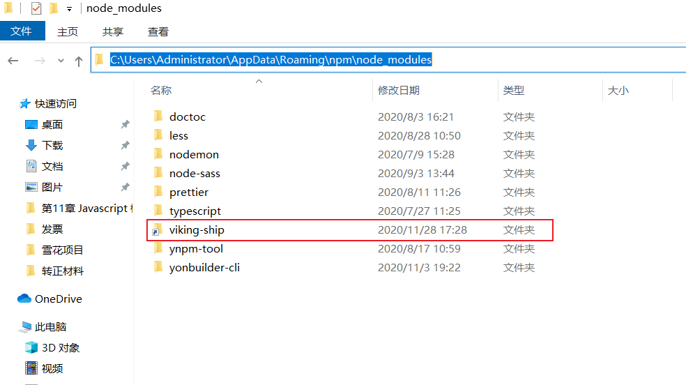

### 1. `npm link` 命令基本说明

1. `npm link` 用于在本地测试我们写好的 `npm` 模块。

2. 可以将我们的本地的 `npm` 模块链接到我们的项目中，方便我们在项目中运行和调试我们的项目。

3. 参考资料：[npm link的使用](https://www.jianshu.com/p/aaa7db89a5b2)
### 2. `npm link` 的基本使用

1. 我们本地有两个项目：viking-ship 和 viking-test，其中 viking-ship 是我们正在开发的 `npm` 本地项目，viking-test 是我们的测试项目，需要引用 viking-ship。

2. 进入 viking-ship 的根目录，执行 `npm link`，执行完这个命令以后，会给出一个提示：`C:\Users\Administrator\AppData\Roaming\npm\node_modules\viking-ship -> D:\Front-End\TS_React-AntdUI\viking-ship
`，这个一个路径软链接信息。
   - `C:\Users\Administrator\AppData\Roaming\npm\node_modules\viking-ship` 表示在全局环境下，创建了这个 viking-ship 模块。实际上，它是创建了一个快捷方式：如下图所示：

   - `D:\Front-End\TS_React-AntdUI\viking-ship` 表示，全局安装的 viking-ship 模块连接到这个目录下的 viking-ship 模块。

3. 进入 viking-test 根目录下，执行：`npm link viking-ship`，执行完成后，给出提示：`D:\Front-End\viking-test\node_modules\viking-ship -> C:\Users\Administrator\AppData\Roaming\npm\node_modules\viking-ship -> D:\Front-End\TS_React-AntdUI\viking-ship
`，在 viking-test 中的 node_modules 中添加了viking-ship 这个模块，实际上也是一个快捷方式，链接到了全局的viking-ship 模块。这样 viking-ship 就会被链接到 viking-test 中。我们就可以在 viking-test 中引用viking-ship 中的内容。